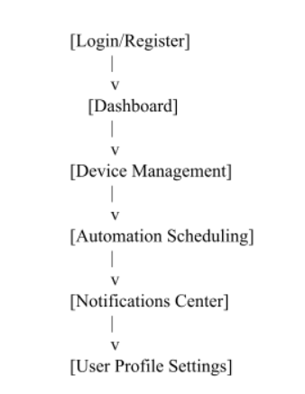
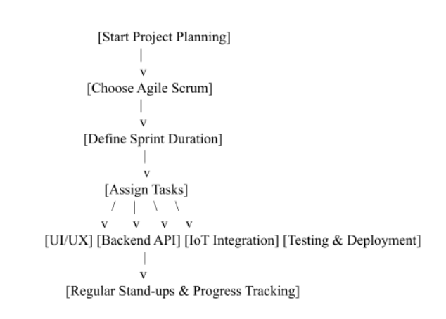
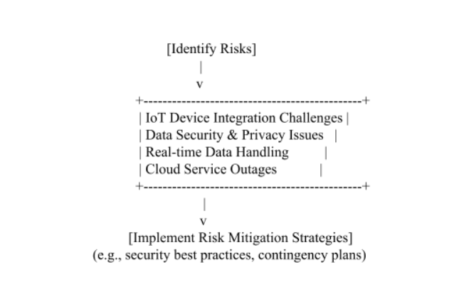

# Smart Home Automation System
- Professor: Roman Canez

- Team members:
    - Ayush Ghimire
    - Blake Cannon

- April 17th, 2026

## Domain and Products Managed
- Application focuses on smart home automation, managing devices such as:
    - Smart lights
    - Thermostats
    - Security Cameras
    - Door Locks

- High-Level Features & Functionality:
    - User authentication and role management
    - Registration and management of IoT devices
    - Real-time status monitoring
    - Automation Scheduling
    - Push notifications for alerts
    - Data visualization dashboards

## Frameworks, Technologies, and Versions
|Technology/Framework|Version|Purpose|
|--|--|--|
|React.js|18|Front-end API|
|Node.js with Express|4.x|Backend API|
|MongoDB|Latest|Data Storage|
|MQTT Protocol|N/A|IoT device communication|
|AWS Services|N/A|Cloud Hosting & Deployment|

## Cloud Provider
We will initially utilize Amazon Web Services (AWS) for hosting our application,
leveraging services such as EC2, S3, and DynamoDB for scalability and robust IoT
support. We may reassess this choice after Milestone 2.

## Initial Sitemap

## Workplanning and Management
- Methodology: Agile Scrum
- Tasks:
    - UI/UX design and frontend development
    - Backend API & database setup
    - IoT device integration
    - Testing & deployment

- Flowchart:

## Risks
- IoT device integration challenges
- Data security and privacy issues
- Real-time data handling performance
- Cloud service outages

flowchart: 

# Conclusion
In conclusion, this Milestone 1 submission marks a solid foundation for the upcoming
development of the smart home automation system. We have clearly defined the project scope,
including the key domains and products we intend to manage, such as smart devices like lights,
thermostats, and security cameras. We’ve outlined the core features and functionalities that the
application will support, such as device management, automation scheduling, and real-time
monitoring.

Additionally, we have selected the appropriate technologies and frameworks, with a
primary focus on React.js for the frontend, Node.js for the backend, and AWS as our cloud
provider. Our initial sitemap provides a logical structure for user navigation, and our project
management approach will follow an agile methodology to ensure flexibility and continuous
improvement.

We also identified potential risks and devised preliminary strategies to mitigate them,
setting the stage for a smooth development process. Overall, this milestone has helped us clarify
our goals, plan our approach, and align our team efforts. We look forward to progressing to the
next phases with a clear understanding and a detailed roadmap.